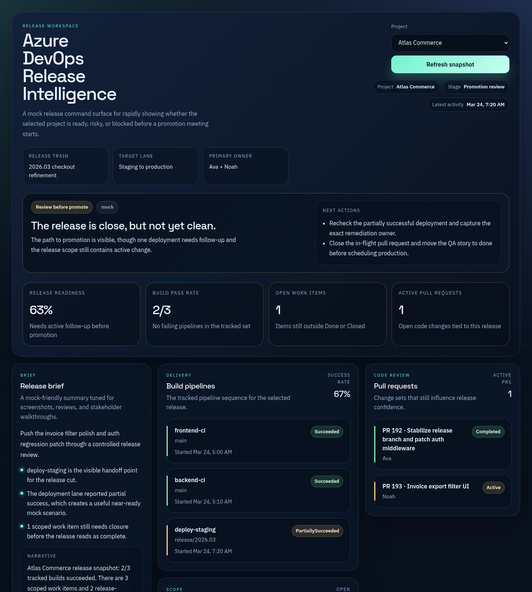
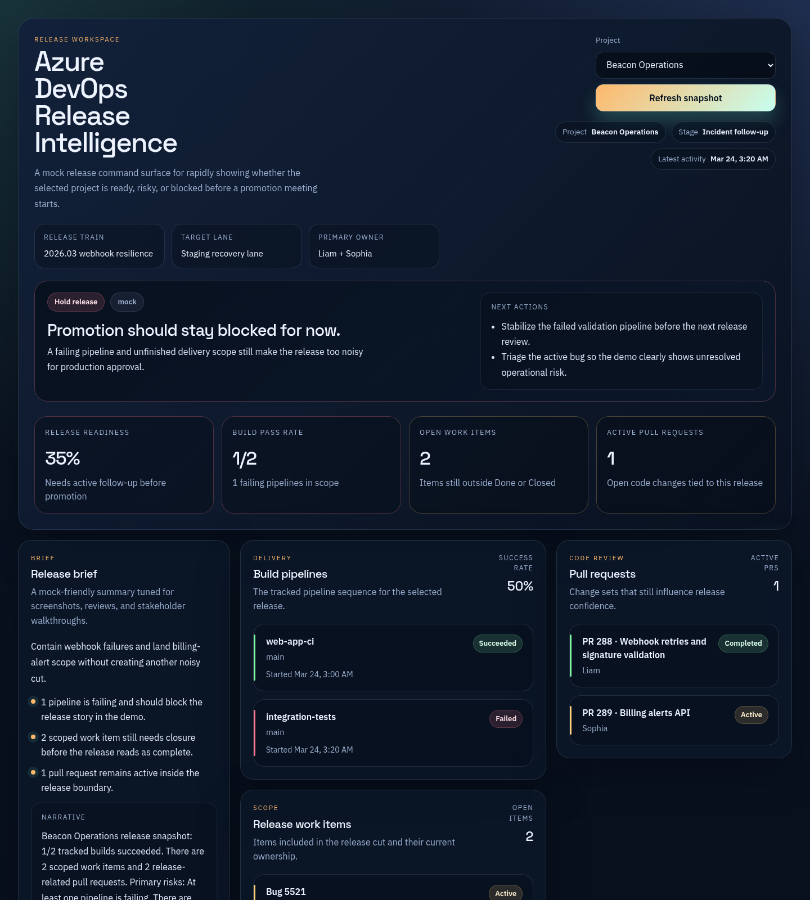
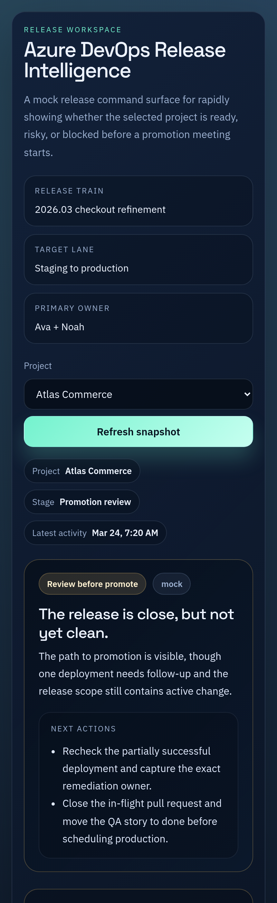

# Azure DevOps Release Intelligence Dashboard

Azure DevOps Release Intelligence Dashboard is a production-style engineering operations interface that turns delivery data into a clearer release story. It is designed to show how build health, deployment state, work tracking, and AI-generated summaries can be brought into a single dashboard for leadership and delivery teams.

## What this project demonstrates

- Operational dashboard design for release visibility
- Aggregation of engineering signals into a decision-friendly interface
- AI-assisted summary generation for release reporting
- Full-stack architecture with lightweight local persistence and mock/live integration paths

## Use case

This type of system is commonly used for:

- Release readiness dashboards
- Engineering leadership reporting tools
- DevOps health and delivery visibility platforms
- Internal operational reporting for software teams

## Key capabilities

- Project selector for switching between delivery contexts
- Build health and deployment status cards
- Work item and pull request rollups
- Risk indicators and release narrative generation
- Mock mode for local demos without external credentials
- URL-driven demo states for portfolio screenshots and walkthroughs

## Screenshots

### Atlas Commerce



### Beacon Operations



### Mobile layout



## Technology snapshot

- React frontend for the dashboard workspace
- Node.js + Express service layer
- SQL.js snapshot persistence
- Optional Azure DevOps and OpenAI integrations

## Requirements

- Node.js 22 or newer
- npm 10 or newer
- WSL/Linux shell when running from a Windows host

## Run locally

### Backend

```bash
cd server
cp .env.example .env
npm install
npm run dev
```

Backend runs at `http://localhost:4100`.

### Frontend

Open another terminal:

```bash
cd client
npm install
npm run dev
```

Frontend runs at `http://localhost:5175`.

Use the mock URLs directly when you want a stable demo state:

- `http://localhost:5175/?project=atlas`
- `http://localhost:5175/?project=beacon`

## Optional live integrations

Edit `server/.env`:

```env
AZDO_ORG_URL=https://dev.azure.com/your-org
AZDO_PROJECT=your-project
AZDO_PAT=your_pat
OPENAI_API_KEY=your_key
OPENAI_MODEL=gpt-5.4-mini
```

Without those values, the app uses realistic demo data.

## Validation

Frontend production build:

```bash
cd client
npm run build
```

Backend syntax check:

```bash
cd server
node --check src/index.js
node --check src/services.js
node --check src/db.js
node --check src/seed.js
```
